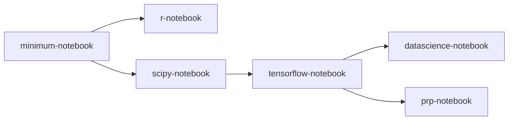

# Available Containers Images

JupyerHub makes use of a container image to execute your code/commands. You must use a container image that contains the software you wish to use. We use [images](https://ucsd-prp.gitlab.io/userdocs/running/sci-img/) provided by Nautilus which are based on [Jupyter Docker Stacks](https://jupyter-docker-stacks.readthedocs.io/en/latest/using/selecting.html#core-stacks). However, additional images can be created for specific needs.

All images include GPU Nvidia and CUDA support, and will provide access to GPU resources if selected during [container launch](/instructionalcluster/students/launchcontainer).

## General Containers Images

The following general purpose containers are available for use.

| Name                  | Image               | Software             |
|:----------------------|:--------------------|:---------------------|
| Stack Minimal         | [minimal-notebook](https://gitlab.nrp-nautilus.io/prp/jupyter-stack/-/tree/prp/minimal-notebook) | Ubuntu 20.04 JupyterLab 3.5.0 Python 3.10.6 Git 2.25.1 Cuda 11.4.r11.4 vi nano tzdata unzip |
| Stack R               | [r-notebook](https://gitlab.nrp-nautilus.io/prp/jupyter-stack/-/tree/prp/r-notebook) | (everything in minimal-notebook) R 4.2.1 IRKernel to support R code in Jupyter notebooks [tidyverse](https://www.tidyverse.org/) packages 1.3.2 [caret](https://topepo.github.io/caret/index.html), [crayon](https://cran.r-project.org/web/packages/crayon/index.html), [devtools](https://cran.r-project.org/web/packages/devtools/index.html), [forecast](https://cran.r-project.org/web/packages/forecast/index.html), [hexbin](https://cran.r-project.org/web/packages/hexbin/index.html), [htmltools](https://cran.r-project.org/web/packages/htmltools/index.html), [htmlwidgets](https://www.htmlwidgets.org/), [nycflights13](https://cran.r-project.org/web/packages/nycflights13/index.html), [randomforest](https://cran.r-project.org/web/packages/randomForest/index.html), [rcurl](https://cran.r-project.org/web/packages/RCurl/index.html), [rmarkdown](https://rmarkdown.rstudio.com/), [rodbc](https://cran.r-project.org/web/packages/RODBC/index.html), [rsqlite](https://cran.r-project.org/web/packages/RSQLite/index.html), [shiny](https://shiny.rstudio.com/), [tidymodels](https://www.tidymodels.org/), [unixodbc](http://www.unixodbc.org/) packages from [conda-forge](https://conda-forge.org/feedstock-outputs/index.html) |
| Stack Scipy           | [scipy-notebook](https://gitlab.nrp-nautilus.io/prp/jupyter-stack/-/tree/prp/scipy-notebook) | (everything in minimal-notebook) [altair](https://altair-viz.github.io/), [beautifulsoup4](https://www.crummy.com/software/BeautifulSoup/), [bokeh](https://docs.bokeh.org/en/latest/), [bottleneck](https://bottleneck.readthedocs.io/en/latest/), [cloudpickle](https://github.com/cloudpipe/cloudpickle), [conda-forge::blas=*=openblas](https://www.openblas.net/), [cython](https://cython.org/), [dask](https://www.dask.org/), [dill](https://pypi.org/project/dill/), [h5py](https://www.h5py.org/), [matplotlib-base](https://matplotlib.org/), [numba](https://numba.pydata.org/), [numexpr](https://github.com/pydata/numexpr), [openpyxl](https://openpyxl.readthedocs.io/en/stable/), [pandas](https://pandas.pydata.org/), [patsy](https://patsy.readthedocs.io/en/latest/), [protobuf](https://developers.google.com/protocol-buffers/docs/pythontutorial), [pytables](https://www.pytables.org/), [scikit-image](https://scikit-image.org/), [scikit-learn](https://scikit-learn.org/stable/), [scipy](https://scipy.org/), [seaborn](https://seaborn.pydata.org/), [sqlalchemy](https://www.sqlalchemy.org/), [statsmodel](https://www.statsmodels.org/stable/index.html), [sympy](https://www.sympy.org/en/index.html), [widgetsnbextension](https://ipywidgets.readthedocs.io/en/latest/user_install.html#installing-in-classic-jupyter-notebook), [xlrd](https://www.python-excel.org/) packages ipympl and ipywidgets for interactive visualizations and plots in Python notebooks [Facets](https://github.com/PAIR-code/facets) for visualizing machine learning datasets |
| Stack Tensorflow      | [tensorflow-notebook](https://gitlab.nrp-nautilus.io/prp/jupyter-stack/-/tree/prp/tensorflow-notebook) | (everything in scipy-notebook) [tensorflow](https://www.tensorflow.org/) 2.10.0 machine learning library |
| Stack Datascience     | [datascience-notebook](https://gitlab.nrp-nautilus.io/prp/jupyter-stack/-/tree/prp/datascience-notebook) | (everything in tensorflow-notebook) [rpy2](https://rpy2.github.io/doc/latest/html/index.html) package The [Julia](https://julialang.org/) 1.7.2 compiler and base environment IJulia to support Julia code in Jupyter notebooks [HDF5](https://github.com/JuliaIO/HDF5.jl), [Gadfly](https://gadflyjl.org/stable/), [RDatasets](https://github.com/JuliaStats/RDatasets.jl) packages |
| Stack PRP             | [prp-notebook](https://gitlab.nrp-nautilus.io/prp/jupyter-stack/-/tree/prp/prp-notebook) | (everything in tensorflow-notebook) [astropy](https://pypi.org/project/astropy/), [bowtie](https://pypi.org/project/bowtie/), [fastai](https://pypi.org/project/fastai/), [keras](https://pypi.org/project/keras/), [nbgitpuller](https://pypi.org/project/nbgitpuller/), [opencv-python](https://pypi.org/project/opencv-python/), [psycopg2-binary](https://pypi.org/project/psycopg2-binary/), [tensorflow-probability](https://pypi.org/project/tensorflow-probability/), [torch](https://pypi.org/project/torch/) 1.12.1, [torchvision](https://pypi.org/project/torchvision/), [visualdl](https://pypi.org/project/visualdl/), [CommPy](https://github.com/veeresht/CommPy) packages |

The following diagram shows the relationship of the above container images.

## Custom Containers Images

| Name                  | Image               | Course         | Software             |
|:----------------------|:--------------------|:---------------|:---------------------|
| None                  |                     |                |                      |
