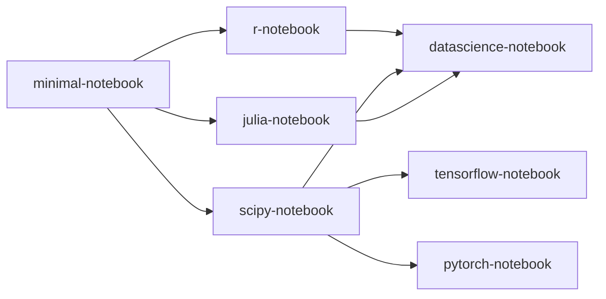
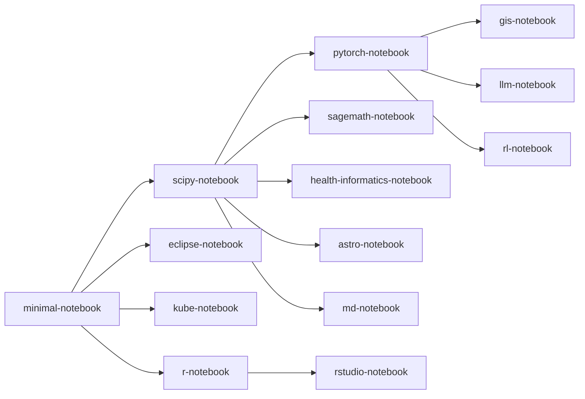

# Available Container Images

JupyerHub makes use of a container image to execute your code/commands. 
You must use a container image that contains the software you wish to use. 
We provide container images from [Jupyter Docker Stacks](https://jupyter-docker-stacks.readthedocs.io/en/latest/using/selecting.html#core-stacks). 
Additional container images can be created for specific needs.

All images include NVIDIA GPU support and will provide access to GPU resources if requested during [container launch](/instructionalcluster/students/launchcontainer).

## General Container Images

The following general purpose containers are available for use.

| Name                  | Image Repo          | Container Image Tag  | Software            |
|:----------------------|:--------------------|:---------------------|:--------------------|
| Jupyter Stack Minimal Notebook     | [minimal-notebook](https://github.com/jupyter/docker-stacks/tree/main/images/minimal-notebook) | quay.io/jupyter/minimal-notebook:2025-07-07 | Ubuntu 24.04   JupyterLab 4.4.4   Python   Git   vi   nano   wget   curl   unzip   tzdata |
| Jupyter Stack R Notebook           | [r-notebook](https://github.com/jupyter/docker-stacks/tree/main/images/r-notebook) | quay.io/jupyter/r-notebook:2025-07-07 | Everything in jupyter/minimal-notebook     The R interpreter and base environment     IRKernel to support R code in Jupyter notebooks     tidyverse packages from conda-forge     caret, crayon, devtools, forecast, hexbin, htmltools, htmlwidgets, nycflights13, randomforest, rcurl, rmarkdown, rodbc, rsqlite, shiny, tidymodels, unixodbc packages from conda-forge |
| Jupyter Stack SciPy Notebook       | [scipy-notebook](https://github.com/jupyter/docker-stacks/tree/main/images/scipy-notebook) | quay.io/jupyter/scipy-notebook:2025-07-07 | Everything in jupyter/minimal-notebook     altair, beautifulsoup4, bokeh, bottleneck, cloudpickle, conda-forge::blas=*=openblas, cython, dask, dill, h5py, jupyterlab-git, matplotlib-base, numba, numexpr, openpyxl, pandas, patsy, protobuf, pytables, scikit-image, scikit-learn, scipy, seaborn, sqlalchemy, statsmodel, sympy, widgetsnbextension, xlrd packages     ipympl and ipywidgets for interactive visualizations and plots in Python notebooks     Facets for visualizing machine learning datasets |
| Jupyter Stack Tensorflow Notebook  | [tensorflow-notebook](https://github.com/jupyter/docker-stacks/tree/main/images/tensorflow-notebook) | quay.io/jupyter/tensorflow-notebook:cuda-2025-07-07 | Everything in jupyter/scipy-notebook and its ancestor images     TensorFlow machine learning library     Jupyter Server Proxy to support TensorBoard |
| Jupyter Stack PyTorch Notebook     | [pytorch-notebook](https://github.com/jupyter/docker-stacks/tree/main/images/pytorch-notebook) | quay.io/jupyter/pytorch-notebook:cuda12-2025-07-07 | Everything in jupyter/scipy-notebook and its ancestor images    pytorch machine learning library (torch, torchaudio and torchvision) |
| Jupyter Stack Julia Notebook       | [julia-notebook](https://github.com/jupyter/docker-stacks/tree/main/images/julia-notebook) | quay.io/jupyter/julia-notebook:2025-07-07 | Everything in jupyter/minimal-notebook     The Julia compiler and base environment     IJulia to support Julia code in Jupyter notebook     Pluto.jl reactive Julia notebook interface, made accessible with jupyter-pluto-proxy     HDF5 package |
| Jupyter Stack Datascience Notebook | [datascience-notebook](https://github.com/jupyter/docker-stacks/tree/main/images/datascience-notebook) | quay.io/jupyter/datascience-notebook:2025-07-07 | Everything in the jupyter/scipy-notebook, jupyter/r-notebook, and jupyter/julia-notebook images and their ancestor images     rpy2 package |

The following diagram shows the relationships of the above container images.

## Custom Container Images
The following custom containers are available for use.

| Name                  | Image Repo          | Container Image Tag | Software             |
|:----------------------|:--------------------|:--------------------|:---------------------|
| R Studio Notebook              | [rstudio-notebook](https://github.com/SDSU-Research-CI/rstudio-desktop-notebook) | ghcr.io/sdsu-research-ci/rstudio-desktop-notebook:v2.0 | Everything in Jupyter Stack R Notebook    RStudio    Jupyter Desktop |
| Eclipse C/C++ Desktop       | [eclipse-notebook](https://github.com/SDSU-Research-CI/eclipse-notebook) | ghcr.io/sdsu-research-ci/eclipse-notebook:v2.0 | Everything in jupyter/minimal-notebook    Eclipse IDE for C/C++ Developers for Linux x86_64    build-essential    Jupyter Desktop    xfce desktop |
| Kube Notebook               | [kube-notebook](https://github.com/SDSU-Research-CI/kube-notebook) | ghcr.io/sdsu-research-ci/kube-notebook:v3.1 | Everything in jupyter/minimal-notebook     rclone     kubectl     Jupyter Desktop     Code Server (VS Code)    Globus Connect Personal    NB Conda Kernels |
| SageMath Notebook           | [sagemath-notebook](https://github.com/SDSU-Research-CI/sagemath-notebook) | ghcr.io/sdsu-research-ci/sagemath-notebook:v2.0 | Everything in jupyter/scipy-notebook    SageMath Kernel |
| GIS Notebook                | [gis-notebook](https://github.com/SDSU-Research-CI/gis-notebook) | ghcr.io/sdsu-research-ci/gis-notebook:v2.0 | Everything in jupyter/pytorch-notebook    beautifulsoup4, boto3, eo-learn, geopandas, geoplot, laspy, lightgbm, natsort, netcdf4, networkx, psycopg2, pysal, rasterio, rclone, selenium, sentinelhub, xeus-python |
| Health Informatics Notebook | [health-informatics-notebook](https://github.com/SDSU-Research-CI/health-informatics-notebook) | ghcr.io/sdsu-research-ci/health-informatics-notebook:v3.0 | Everything in jupyter/scipy-notebook    biopython, pytest, fastp, samtools, bwa, varscan, bcftools, mummer, ensembl-vep, goalign, gotree, modeltest-ng, raxml-ng, spades, mafft |
| Astro Notebook              | [astro-notebook](https://github.com/SDSU-Research-CI/astro-notebook) | ghcr.io/sdsu-research-ci/astro-notebook:v2.0 | Everything in jupyter/scipy-notebook    astropy, astroquery, photutils, emcee, corner, fsps, lxml, reportlab    SKIRT    PTS |
| LLM Notebook                | [llm-notebook](https://github.com/SDSU-Research-CI/LLM-Notebook) | ghcr.io/sdsu-research-ci/llm-notebook:v3.0 | Everything in jupyter/pytorch-notebook    rclone, bitsandbytes, transformers, peft, accelerate, trl, ollama-python, openai, PyAudio, portaudio, cuda-nvcc, deepspeed, langchain, huggingface_hub, auto-gpt, autoawq, xformers, dask-kubernetes, chromadb    FastChat    Ollama    Code Server (VS Code)     Jupyter AI|
| Molecular Dynamics Notebook                | [md-notebook](https://github.com/SDSU-Research-CI/md-notebook) | ghcr.io/sdsu-research-ci/md-notebook:v3.0 | Everything in jupyter/scipy-notebook     cmake   gcc   g++   openmpi-bin   vim   LAMMPS   ovito   Quantum Espresso   Jupyter Desktop |
| Reinforcement Learning Notebook                | [rl-notebook](https://github.com/SDSU-Research-CI/rl-notebook) | ghcr.io/sdsu-research-ci/rl-notebook:v1.0 | Everything in jupyter/pytorch-notebook    rclone     kubectl     Jupyter Desktop     Desktop VS Code    Code Server (VS Code)    Globus Connect Personal    NB Conda Kernels    Gymnasium |

The following diagram shows the relationships between the general and custom container images.

